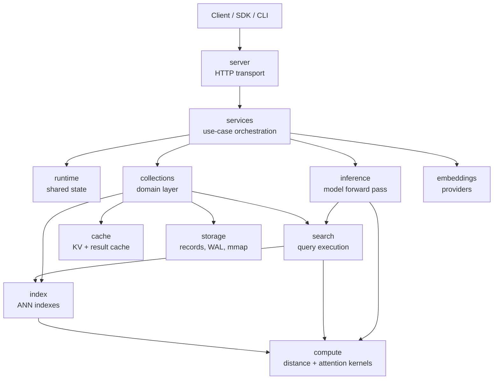

<p align="center">
    <b>Inference Engine for Retrieval-Augmented Systems</b>
</p>

<p align="center">
    <a href="https://crates.io/crates/piramid"></a>
</p>

<p align="center">
  <a href="#overview">Overview</a> •
  <a href="#quickstart">Quickstart</a> •
  <a href="#usage">Usage</a> •
  <a href="docs/architecture.md">Architecture</a> •
  <a href="docs/gpu-stack.md">GPU Stack</a> •
  <a href="docs/setup.md">Setup</a> •
  <a href="docs/deployment.md">Deployment</a> •
  <a href="https://piramiddb.com/blogs/contributions">Contributing</a>
</p>

## Overview

Standard RAG pipelines retrieve chunks from a vector database, concatenate them into the prompt, and send everything to a separate inference service. Two network hops, redundant serialization, and context windows filled with stuffed text.

Piramid runs retrieval and transformer inference in a single Rust process. Retrieved vectors are fed into the model's cross-attention layers during the forward pass instead of being prepended as context tokens.

One binary. One process. Retrieval in the attention loop, not in the prompt.

https://github.com/user-attachments/assets/487cbc0f-c279-4a15-a160-9acd4666fbe6

### Architecture

Piramid is organized as layered Rust modules. Transport, orchestration, indexing, inference, and persistence stay separate. This diagram shows dependency flow, not folder nesting.



For the full codebase guide, see [docs/architecture.md](docs/architecture.md).
For GPU/inference boundary and stack scaffolding, see [docs/gpu-stack.md](docs/gpu-stack.md).

## Quickstart

```bash
cargo install piramid
piramid serve --data-dir ./data
```

Server defaults to `http://0.0.0.0:6333`. Data is stored under `~/.piramid` by default; set `DATA_DIR` to override.

For full setup on Linux, macOS, WSL2, and Docker, see [docs/setup.md](docs/setup.md).
For published Docker images and release deployment, see [docs/deployment.md](docs/deployment.md).
For CI and release workflows, see [docs/devops.md](docs/devops.md).

## Usage

### Retrieval-augmented inference

```bash
# Run inference with retrieval in the attention loop
curl -X POST http://localhost:6333/api/infer \
  -H "Content-Type: application/json" \
  -d '{
    "model": "qwen2.5-3b",
    "prompt": "Summarize our return policy",
    "collection": "docs",
    "k": 10
  }'
```

Retrieved neighbors are injected into cross-attention layers during the forward pass — not prepended as context tokens.

### Collections and vectors

```bash
# Create collection
curl -X POST http://localhost:6333/api/collections \
  -H "Content-Type: application/json" \
  -d '{"name": "docs"}'

# Store vectors
curl -X POST http://localhost:6333/api/collections/docs/vectors \
  -H "Content-Type: application/json" \
  -d '{
    "vector": [0.1, 0.2, 0.3, 0.4],
    "text": "Hello world",
    "metadata": {"category": "greeting"}
  }'

# Embed and store text
curl -X POST http://localhost:6333/api/collections/docs/embed \
  -H "Content-Type: application/json" \
  -d '{"texts": ["hello", "bonjour"], "metadata_list": [{"lang": "en"}, {"lang": "fr"}]}'

# Search
curl -X POST http://localhost:6333/api/collections/docs/search \
  -H "Content-Type: application/json" \
  -d '{"vector": [0.1, 0.2, 0.3, 0.4], "k": 5}'
```

Health and metrics: `/api/health`, `/api/readyz`, `/api/metrics`.

## License

[Apache 2.0 License](LICENSE)
