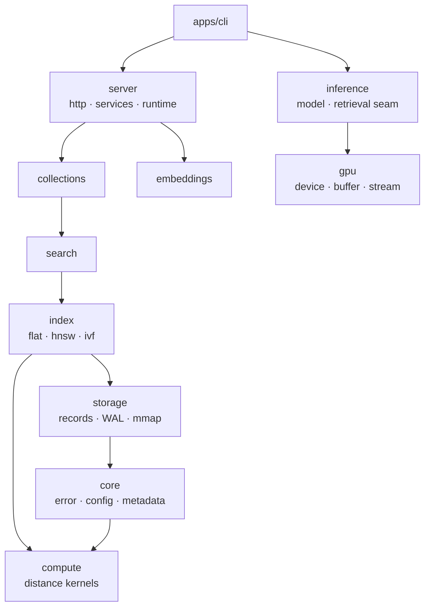

<p align="center">
    <b>Inference Engine for Retrieval Systems</b>
</p>

<p align="center">
    <a href="https://crates.io/crates/piramid"></a>
    <a href="LICENSE"></a>
</p>

<p align="center">
  <a href="#overview">Overview</a> •
  <a href="#quickstart">Quickstart</a> •
  <a href="#usage">Usage</a> •
  <a href="#where-this-is-going">Direction</a> •
  <a href="docs/ARCHITECTURE.md">Architecture</a> •
  <a href="docs/SETUP.md">Setup</a> •
  <a href="docs/ROADMAP.md">Roadmap</a> •
  <a href="https://piramiddb.com/blogs/contributions">Contributing</a>
</p>

## Overview

Standard RAG retrieves chunks from a vector database, concatenates them into the prompt, and sends
everything to a separate inference service. Two network hops, redundant serialization, and context
windows filled with stuffed text — paid on every query.

Piramid is being built so retrieval and transformer inference share one Rust process, with
retrieved vectors entering the model through cross-attention during the forward pass instead of
being prepended as context tokens.

**Today Piramid is the retrieval half of that: a single-node vector database.** Collections, kNN
and range search, metadata filtering, embedding ingestion, WAL durability, three ANN index
families, and SIMD distance kernels. The inference half is scaffolding with its seams defined and
no implementation behind them — see [Where this is going](#where-this-is-going).

https://github.com/user-attachments/assets/487cbc0f-c279-4a15-a160-9acd4666fbe6

### Architecture

Eleven crates, one binary. A crate may depend on one below it; the reverse is a layering violation
that `scripts/check-deps.sh` fails CI on.



`compute` and `gpu` depend on nothing in the workspace. `gpu` owns the device runtime so that
`compute` and `inference` can share one `Device` — vectors and model weights in a single address
space is the whole reason for the single-process design.

Full guide: [docs/ARCHITECTURE.md](docs/ARCHITECTURE.md). Decisions and their reasoning:
[docs/decisions/](docs/decisions/).

## Quickstart

```bash
cargo install piramid
piramid serve --data-dir ./data
```

Defaults to `http://0.0.0.0:6333`; data lives under `~/.piramid` unless `DATA_DIR` says otherwise.
Every setting is in [`.env.example`](.env.example).

Docker:

```bash
just up          # or: docker compose -f deploy/compose.yml up -d
```

From source:

```bash
just bootstrap   # .env, git hooks, dependencies
just check       # fmt, clippy, tests, layering
just serve
```

## Usage

```bash
# Create a collection
curl -X POST http://localhost:6333/api/collections \
  -H "Content-Type: application/json" \
  -d '{"name": "docs"}'

# Store a vector
curl -X POST http://localhost:6333/api/collections/docs/vectors \
  -H "Content-Type: application/json" \
  -d '{"vector": [0.1, 0.2, 0.3, 0.4], "text": "Hello world", "metadata": {"category": "greeting"}}'

# Embed and store text (requires EMBEDDING_PROVIDER)
curl -X POST http://localhost:6333/api/collections/docs/embed \
  -H "Content-Type: application/json" \
  -d '{"texts": ["hello", "bonjour"], "metadata_list": [{"lang": "en"}, {"lang": "fr"}]}'

# Search
curl -X POST http://localhost:6333/api/collections/docs/search \
  -H "Content-Type: application/json" \
  -d '{"vector": [0.1, 0.2, 0.3, 0.4], "k": 5}'
```

Health and metrics: `/api/health`, `/api/readyz`, `/api/metrics`, `/api/version`.

## Where this is going

The thesis: **knowledge does not have to live in the weights, and it does not have to live in the
prompt either.** Retrieval that enters through cross-attention costs no context window, and can
happen *during* generation rather than once before it.

Piramid commits to the **seam** for that, not to one mechanism. `inference::retrieval::RetrievalHook`
defines when retrieval may occur and what it may touch; chunked cross-attention, residual-stream
gating, and learned index routing are all implementations of one trait. The trait exists before any
code calls it, because a forward-pass driver written without the seam is very hard to retrofit with
one.

The evidence for the specific RETRO mechanism is genuinely mixed, and
[ADR 0006](docs/decisions/0006-retrieval-fusion-seam.md) lays out the case against it as well as
for it, along with the experiment that would settle it. Building the seam rather than the mechanism
means the infrastructure — device runtime, contiguous vector layout, kernel dispatch, indexes —
holds its value whichever way that lands.

See [docs/ROADMAP.md](docs/ROADMAP.md), including a **Known gaps** section listing what is
currently missing or wrong.

## Contributing

`just doctor` checks your setup, `just check` is the gate. Read
[AGENTS.md](AGENTS.md) for layout, the dependency law, and conventions.

## License

[Apache 2.0](LICENSE)
