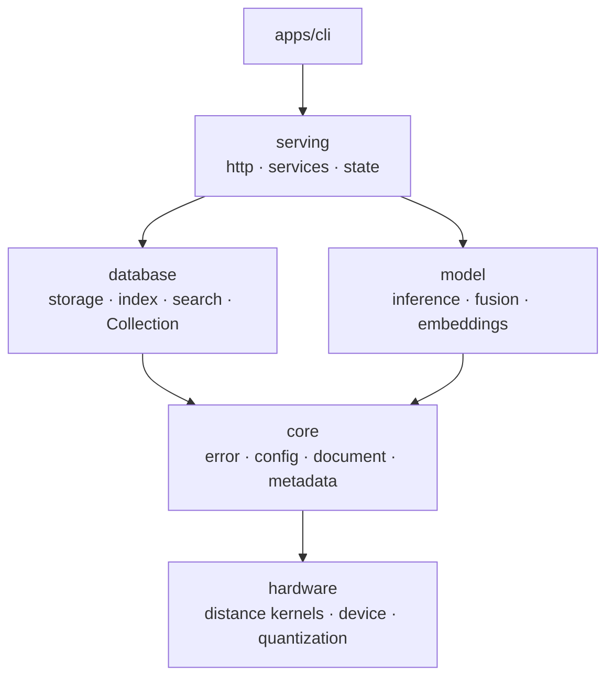

<p align="center">
    <b>Long-term memory for language models</b><br/>
    <sub>Fast enough to use mid-thought, not just before it</sub>
</p>

<p align="center">
    <a href="https://crates.io/crates/piramid"></a>
    <a href="LICENSE"></a>
</p>

<p align="center">
  <a href="#what-this-is">What this is</a> •
  <a href="#quickstart">Quickstart</a> •
  <a href="#usage">Usage</a> •
  <a href="#where-this-is-going">Where this is going</a> •
  <a href="docs/ARCHITECTURE.md">Architecture</a> •
  <a href="docs/SETUP.md">Setup</a> •
  <a href="docs/ROADMAP.md">Roadmap</a>
</p>

## What this is

A database is something you query. A memory is something you have. The difference is latency.

Retrieval-augmented generation today makes a model guess what it will need before it starts
thinking. You embed the query, search once, stuff the results into the prompt, and generate. If at
token 300 the model needs something that was not in the top-5 at token 0, it cannot ask — it has
no way to. That is not a tuning problem. It is what happens when retrieval and generation are two
processes with a network between them: when a lookup costs milliseconds and a hop, you only get to
do it once, and everything downstream is compensation for that single shot.

Piramid holds the documents, the model weights and the KV cache in one process on one device, so a
retrieval costs microseconds instead of milliseconds. At that price it stops being a preprocessing
step and becomes an operation inside the forward pass — cheap enough to run sixteen times during a
generation instead of once. That is the whole idea: **speed is what turns a database into a
memory.**

This is not the same thing as agent memory. Libraries like mem0 or Zep add memory *around* a model
— conversation history and user facts, behind an API. Piramid puts it *inside* the forward pass.
One is a library call; this is closer to a kernel.

It is also not "colocate your vector DB and your inference server." Same process is not the same
address space, and the same address space is not the same device. Colocation removes a network
hop. It does not put the candidate slab in VRAM beside the weights, and that is the part that makes
a retrieval cheap enough to do continuously.


https://github.com/user-attachments/assets/487cbc0f-c279-4a15-a160-9acd4666fbe6

### How it's put together

Five library crates under `apps/engine`, plus the binary that links them. A crate may depend on
one below it; the reverse fails CI.



`hardware` depends on nothing else, so kernels can be benchmarked on their own and `model` can get
a device without reaching through retrieval math. `model` depends on nothing in `database`, which
is what keeps a collection queryable with no model loaded.

Built on Rust 1.87 with `axum` and `tokio` for the server, `serde` for the wire and disk formats,
`wide` for SIMD kernels that lower to AVX2 and NEON, `memmap2` for zero-copy record reads,
`dashmap` and `parking_lot` for the concurrent paths, and `tracing` with OTLP for telemetry. The
`gpu-cuda` and `inference-candle` features are reserved for CUDA and model execution and are still
empty, so a default build needs neither a CUDA toolkit nor a model runtime. The full list and the
reasoning is in [docs/ARCHITECTURE.md](docs/ARCHITECTURE.md#what-its-built-on).

Full guide in [docs/ARCHITECTURE.md](docs/ARCHITECTURE.md). Decisions and their reasoning in
[docs/decisions/](docs/decisions/).

## Quickstart

```bash
cargo install piramid
piramid serve --data-dir ./data
```

Listens on `0.0.0.0:6333`. Data goes to `~/.piramid` unless `startup.data_dir` says otherwise. Every
setting is listed in [`.env.example`](.env.example).

Or with Docker:

```bash
docker run -p 6333:6333 -v piramid-data:/data ghcr.io/ashworks1706/piramid:main
```

`piramid --help` lists the rest: `init` writes a config file, `show config` and `show metrics`
print resolved state, and `support-bundle` collects diagnostics for a bug report.

## Usage

```bash
# Create a collection
curl -X POST http://localhost:6333/api/collections \
  -H "Content-Type: application/json" \
  -d '{"name": "docs"}'

# Store vectors. Every write and query takes lists, one document per position.
curl -X POST http://localhost:6333/api/collections/docs/vectors \
  -H "Content-Type: application/json" \
  -d '{"vectors": [[0.1, 0.2, 0.3, 0.4]], "texts": ["Hello world"],
       "metadata": [{"category": "greeting"}]}'

# Embed and store text (needs startup.embedding set)
curl -X POST http://localhost:6333/api/collections/docs/embed \
  -H "Content-Type: application/json" \
  -d '{"texts": ["hello", "bonjour"], "metadata": [{"lang": "en"}, {"lang": "fr"}]}'

# Search. One result list comes back per query vector, in request order.
curl -X POST http://localhost:6333/api/collections/docs/search \
  -H "Content-Type: application/json" \
  -d '{"vectors": [[0.1, 0.2, 0.3, 0.4]], "k": 5}'

# Search with a metadata filter: {"field": {"op": value}},
# where op is eq, ne, gt, gte, lt, lte, or in.
curl -X POST http://localhost:6333/api/collections/docs/search \
  -H "Content-Type: application/json" \
  -d '{"vectors": [[0.1, 0.2, 0.3, 0.4]], "k": 5,
       "filter": {"category": {"eq": "greeting"}}}'
```

Operational endpoints: `/api/health`, `/api/readyz`, `/api/version`, `/api/metrics` for the JSON
view and `/metrics` for Prometheus.

## Where this is going

Knowledge does not have to live in a model's weights, and it does not have to live in the prompt
either. Retrieval that reaches the model directly costs no context window, and it can happen
during generation rather than once before it.

Retrieval inside a generation — repeated, overlapped with compute, against state that never leaves
the device — is what the single process is for. Retrieval before prefill costs one service hop and
does not need one.

Piramid commits to the seam for that rather than to a particular mechanism.
`model::fusion::RetrievalHook` says when retrieval may happen and what it may touch, not how
retrieved data gets combined. Chunked cross-attention, residual-stream gating, and learned index
routing would all be implementations of the same trait. The trait exists before anything calls it
because a forward-pass driver written without the seam is hard to retrofit with one.

### How you will know whether this was right

The claim is falsifiable and the test is written down before the code, which is the point.

Retrieval before prefill is the control arm — the ordinary split stack, colocated and warm, not a
straw man. Against it, four configurations get measured on the same corpus and the same token
budget: split process; in-process CPU index; in-process device-resident index; and retrieval
overlapped with prefill on its own stream. The numbers reported are TTFT, tokens/sec, p50/p95 and
recall.

If the device-resident and overlapped arms do not beat a well-tuned split stack, the thesis is
wrong and the result gets published anyway. A benchmark whose control arm is weak proves nothing,
so the control arm is specified first.

[docs/ROADMAP.md](docs/ROADMAP.md) has the plan, as a todo list.

## Working on Piramid

Contributor tooling is separate from the shipped binary. `just` drives the repo — building,
testing, linting, running the site — and is never needed to *use* Piramid. `piramid` is the binary
users install, and it has no idea `just` exists.

```bash
just bootstrap   # .env, git hooks, dependencies
just doctor      # check your tooling
just check       # the gate: fmt, clippy, tests, layering
just serve       # run the server from source
just web         # the site on :3000
```

[AGENTS.md](AGENTS.md) covers the layout, the dependency rule, and the conventions.
[docs/SETUP.md](docs/SETUP.md) has the full list.

## License

[Apache 2.0](LICENSE)
