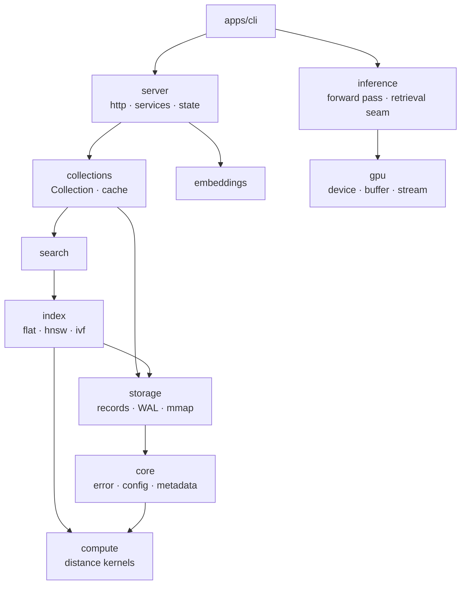

<p align="center">
    <b>Inference Engine for Retrieval Systems</b>
</p>

<p align="center">
    <a href="https://crates.io/crates/piramid"></a>
    <a href="LICENSE"></a>
</p>

<p align="center">
  <a href="#what-this-is">What this is</a> •
  <a href="#quickstart">Quickstart</a> •
  <a href="#usage">Usage</a> •
  <a href="#where-this-is-going">Where this is going</a> •
  <a href="docs/ARCHITECTURE.md">Architecture</a> •
  <a href="docs/SETUP.md">Setup</a> •
  <a href="docs/ROADMAP.md">Roadmap</a>
</p>

## What this is

Today Piramid is a single-node vector database written in Rust. Collections, kNN and range
search, metadata filtering, embedding ingestion, WAL durability, three ANN index families, and
SIMD distance kernels. It runs as one binary with no external dependencies.

The longer-term goal is to run retrieval and transformer inference in the same process, with
retrieved vectors entering the model through cross-attention during the forward pass rather than
being pasted into the prompt. That half is scaffolding: the seams are defined, there is no
implementation behind them yet. See [Where this is going](#where-this-is-going).

https://github.com/user-attachments/assets/487cbc0f-c279-4a15-a160-9acd4666fbe6

### How it's put together

Eleven library crates under `apps/engine`, plus the binary that links them. A crate may depend on
one below it in the list; the reverse fails CI.



`compute` and `gpu` depend on nothing else in the workspace. `gpu` owns the device runtime so that
both `compute` and `inference` can share one device, which is what lets vectors and model weights
live in the same address space later.

Built on Rust 1.87 with `axum` and `tokio` for the server, `serde` for the wire and disk formats,
`wide` for SIMD kernels that lower to AVX2 and NEON, `memmap2` for zero-copy record reads,
`dashmap` and `parking_lot` for the concurrent paths, and `tracing` with OTLP for telemetry. The
`gpu-cuda` and `inference-candle` features are reserved for CUDA and model execution and are still
empty, so a default build needs neither a CUDA toolkit nor a model runtime. The full list and the
reasoning is in [docs/ARCHITECTURE.md](docs/ARCHITECTURE.md#what-its-built-on).

Full guide in [docs/ARCHITECTURE.md](docs/ARCHITECTURE.md). Decisions and their reasoning in
[docs/decisions/](docs/decisions/).

## Quickstart

```bash
cargo install piramid
piramid serve --data-dir ./data
```

Listens on `0.0.0.0:6333`. Data goes to `~/.piramid` unless `startup.data_dir` says otherwise. Every
setting is listed in [`.env.example`](.env.example).

Or with Docker:

```bash
docker run -p 6333:6333 -v piramid-data:/data ghcr.io/ashworks1706/piramid:main
```

`piramid --help` lists the rest: `init` writes a config file, `show config` and `show metrics`
print resolved state, and `support-bundle` collects diagnostics for a bug report.

## Usage

```bash
# Create a collection
curl -X POST http://localhost:6333/api/collections \
  -H "Content-Type: application/json" \
  -d '{"name": "docs"}'

# Store vectors. Every write and query takes lists, one document per position.
curl -X POST http://localhost:6333/api/collections/docs/vectors \
  -H "Content-Type: application/json" \
  -d '{"vectors": [[0.1, 0.2, 0.3, 0.4]], "texts": ["Hello world"],
       "metadata": [{"category": "greeting"}]}'

# Embed and store text (needs startup.embedding set)
curl -X POST http://localhost:6333/api/collections/docs/embed \
  -H "Content-Type: application/json" \
  -d '{"texts": ["hello", "bonjour"], "metadata": [{"lang": "en"}, {"lang": "fr"}]}'

# Search. One result list comes back per query vector, in request order.
curl -X POST http://localhost:6333/api/collections/docs/search \
  -H "Content-Type: application/json" \
  -d '{"vectors": [[0.1, 0.2, 0.3, 0.4]], "k": 5}'

# Search with a metadata filter: {"field": {"op": value}},
# where op is eq, ne, gt, gte, lt, lte, or in.
curl -X POST http://localhost:6333/api/collections/docs/search \
  -H "Content-Type: application/json" \
  -d '{"vectors": [[0.1, 0.2, 0.3, 0.4]], "k": 5,
       "filter": {"category": {"eq": "greeting"}}}'
```

Operational endpoints: `/api/health`, `/api/readyz`, `/api/version`, `/api/metrics` for the JSON
view and `/metrics` for Prometheus.

## Where this is going

The idea is that knowledge does not have to live in a model's weights, and it does not have to
live in the prompt either. Retrieval that reaches the model through cross-attention costs no
context window, and it can happen during generation rather than once before it.

Piramid commits to the seam for that rather than to a particular mechanism.
`inference::augment::RetrievalHook` says when retrieval may happen and what it may touch, not how
retrieved data gets combined. Chunked cross-attention, residual-stream gating, and learned index
routing would all be implementations of the same trait. The trait exists before anything calls it
because a forward-pass driver written without the seam is hard to retrofit with one.

The evidence for the specific RETRO mechanism is mixed, and
[ADR 0006](docs/decisions/0006-retrieval-fusion-seam.md) lays out the case against it alongside
the case for, plus the experiment that would settle it. Building the seam rather than the
mechanism means the device runtime, vector layout, kernel dispatch, and indexes stay useful
whichever way that goes.

[docs/ROADMAP.md](docs/ROADMAP.md) has the plan, as a todo list.

## Working on Piramid

Contributor tooling is separate from the shipped binary. `just` drives the repo — building,
testing, linting, running the site — and is never needed to *use* Piramid. `piramid` is the binary
users install, and it has no idea `just` exists.

```bash
just bootstrap   # .env, git hooks, dependencies
just doctor      # check your tooling
just check       # the gate: fmt, clippy, tests, layering
just serve       # run the server from source
just web         # the site on :3000
```

[AGENTS.md](AGENTS.md) covers the layout, the dependency rule, and the conventions.
[docs/SETUP.md](docs/SETUP.md) has the full list.

## License

[Apache 2.0](LICENSE)
