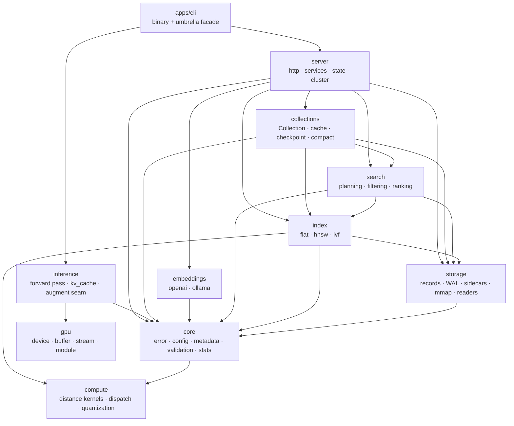
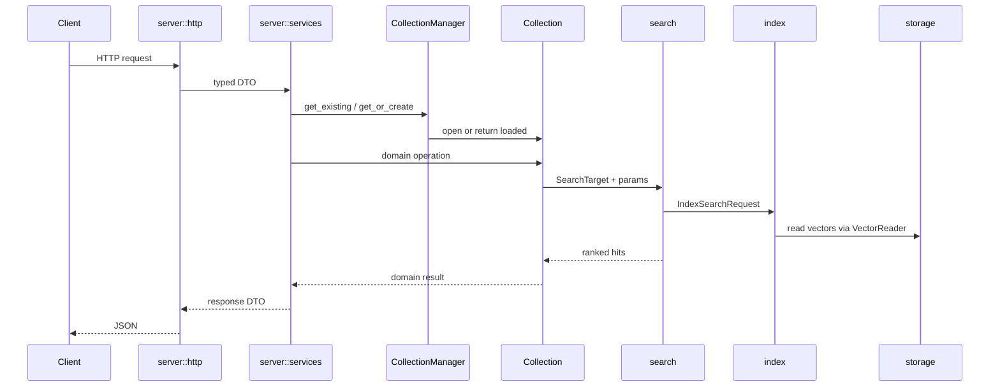
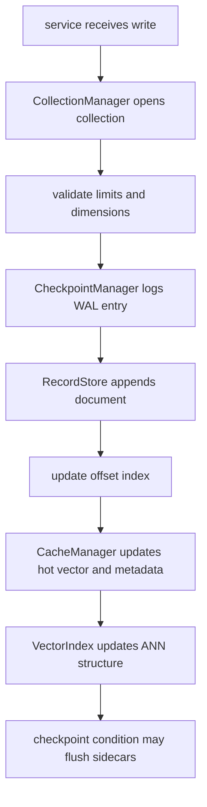

# Architecture

How the workspace is cut, why each boundary sits where it does, and what has to stay true.

## The problem this shape solves

Piramid runs retrieval and, eventually, transformer inference in one process. That single-process
goal is exactly why internal boundaries matter: with no network between the layers, nothing keeps
them from growing into each other except discipline, and discipline that nothing checks tends not
to survive.

So the layering is physical. Each layer is a crate, and `scripts/check-deps.sh` fails CI on an edge
that isn't in the rule below.

## The tree

```text
apps/                     everything we author
  engine/                 the library crates
    core/                 errors, config, metadata, validation, stats
    observability/        where measurements go: subscriber, OTLP, Prometheus
    hardware/             code that changes when the machine changes
      compute  gpu
    data/                 where vectors live and who owns them
      storage  collections
    retrieval/            how you find them
      index  search  embeddings
    inference/            how you run a model over them
    server/               how the outside world reaches it
  cli/                    the piramid binary, which links the engine into one artifact
  website/                piramiddb.com, with blog content and images inside it
  sdk/                    npm and python clients

deploy/  docs/  scripts/  .claude/  .github/     how it's built, shipped, and explained
```

Two things the naming is doing. `engine/` says what the thing is; "crates" describes Rust's
compilation model, not the product. And one binary doesn't mean one folder: the engine is eleven
crates and `apps/cli` is what links them into an artifact.

The groups answer "what is this for", and each cut is a real one.

`hardware/` is the code that changes when the machine changes. `compute` owns what cosine means
and which backend runs it; `gpu` owns the device, meaning contexts, buffers, streams, and modules.
They're separate because two subsystems need a device — `compute` for distance kernels and
`inference` for model execution — and neither should have to depend on the other to allocate
memory.

`data/` is where vectors live and who owns them. `storage` is bytes: records, WAL, mmap, layout.
`collections` is the object that owns a store, a cache, a checkpoint policy, and an index. A
collection is acted on by search rather than being a way of finding things itself.

`retrieval/` is how you find them: `index` for the ANN structure, `search` for planning and
scoring, `embeddings` for turning text into a vector to search with.

`core` and `observability` sit flat because they're used from everywhere rather than at one level.
`core` is the vocabulary everything shares. `observability` is used by `server`, which renders
metrics, and directly by `apps/cli`, which installs the tracing subscriber before any server
exists. `server` and `inference` are flat because each is one crate, and a group of one buys
nothing.

`core::stats` and `observability` split a concern that's easy to read as two names for one thing.
`stats` is what the engine measures about itself: latency, lock contention, embedding throughput,
held as plain atomics with no dependency on `tracing` or any exporter, so `collections` and
`server` can record into it freely. `observability` is where those numbers go, and it carries
`tracing-subscriber` and OpenTelemetry. Merging them would link an exporter stack into every crate
that times a lock.

Folder groups are for finding your way around. They deliberately don't line up with the dependency
order: `core` depends on `hardware/compute` for the `ExecutionMode` and `Metric` types that
configuration carries.

## Crates



| Crate | Owns | Must not |
|---|---|---|
| `core` | Every error the app wraps, all configuration (including per-index-family parameters), metadata and filters, validation, `stats` | Know about HTTP, end the process, or depend on an exporter |
| `observability` | Tracing subscriber, OTLP export, Prometheus encoding | Integrate with a vendor's product |
| `compute` | Distance math, backend selection, quantization encodings | Depend on anything in the workspace |
| `gpu` | Device runtime: contexts, buffers, streams, modules, kernels | Contain math semantics or leak vendor types |
| `storage` | Records, WAL, `SidecarManager`, mmap, vector layout | Decide API behaviour or collection lifecycle |
| `index` | ANN traversal and the sidecar format | Own collection storage, the vectors, or a second copy of its own config |
| `search` | Overfetch planning, scoring, filtering, ranking | Know what a `Collection` is |
| `collections` | The `Collection` object, its `cache` (resident `VectorStore` + bounded `MetadataCache`), checkpoint, compaction | Serve HTTP, or evict a vector |
| `embeddings` | Provider adapters, caching, retries, `EmbeddingsManager` | Know about collections, or depend on `inference` |
| `inference` | Model execution, KV cache, batching, sampling, the `RetrievalHook` seam | Depend on the retrieval stack, or be required for retrieval to work |
| `server` | Routes, handlers, services (admission, locks, metrics, DTOs), `AppState`, routing | Touch file formats or index internals |
| `apps/cli` | Argument parsing, process lifecycle, terminal output | Contain domain logic |

## What it's built on

Rust 1.87, edition 2021. One binary, no runtime services to install alongside it: the storage
engine, the indexes and the HTTP server are all in-process.

| Area | Crate | Why this one |
|---|---|---|
| HTTP | `axum`, `tower-http` | Rides on `hyper` and the `tower` middleware ecosystem, so timeouts, CORS and tracing are layers rather than framework features |
| Async | `tokio` | What `axum` and `reqwest` already require; a second runtime would mean two thread pools |
| Serialization | `serde` with `serde_json`, `serde_yaml`, `bincode` | JSON on the wire and in the WAL, YAML for config, `bincode` for the index sidecars where size matters more than readability |
| Errors | `thiserror` | Typed enums per layer. No `anyhow` in libraries: a caller has to be able to match on the failure |
| SIMD | `wide` | `f32x8` that lowers to AVX2 on x86_64 and NEON on aarch64, so one kernel covers both without intrinsics |
| Parallelism | `rayon` | Work-stealing for the batch kernels, kept out of the hot single-pair path |
| Storage | `memmap2` | Reads records without copying them into the heap first |
| Concurrency | `dashmap`, `parking_lot`, `lru` | Sharded map so unrelated collections don't contend, smaller and faster locks, bounded caches |
| Telemetry | `tracing`, OpenTelemetry, OTLP | Open standards only, no vendor SDK. See ADR 0011 |
| CLI | `clap` | Derive API, so the parser and the help text cannot drift apart |
| Benchmarks | `criterion` | Statistical comparison, which matters when a kernel change is worth single-digit percent |

Two features are reserved for hardware and model runtimes. Both are additive, off by default, and
currently empty — the backend modules behind them are stubs, so `cargo build` needs no CUDA
toolkit and no model runtime, and `CudaStrategy::is_available` reports `false` rather than
pretending:

| Feature | Intended crate | For |
|---|---|---|
| `gpu-cuda` | `cudarc` | Device runtime in `hardware/gpu`, confined to `gpu/backends/` |
| `inference-candle` | `candle` | Model execution in `inference`, confined to `inference/backends/` |

When those land, the vendor types stay inside those backend modules. Nothing above them imports
either crate, which is what allows a second backend later without touching the layers between.

The website is separate and ships nothing: Next.js 16 on React 19, TypeScript, Tailwind 4, and
MDX through `next-mdx-remote` with KaTeX for the maths in the blog posts.

## The dependency rule

A crate may depend on one listed below it. The reverse is a violation.

```
compute ─┐                    gpu ─┐
         │                         ├─→ inference ─┐
core ────┼─→ storage ─→ index ─→ search ─→ collections ─→ server ─→ cli
         │        └────────→ cache ───────────┘   │
         └─→ embeddings ──────────────────────────┘
```

`scripts/check-deps.sh` holds the allow-list. Adding an edge means editing that file and this
document in the same change.

### Why compute and gpu are leaves

Neither depends on anything in the workspace, `core` included.

`compute` is a leaf because kernels should be liftable into a standalone benchmark, and because a
kernel layer that imports application configuration can't be reasoned about on its own.
`ExecutionMode` lives in `compute` and is re-exported by `config` rather than the other way round;
it names a backend, which is a compute concern.

`gpu` is a leaf because both `compute` and `inference` need a device. If the device runtime lived
inside `compute`, inference would depend on retrieval math to allocate memory. Keeping `gpu` a peer
means both share one `Device`, which is what puts vectors and model weights in the same address
space.

```
compute/strategies/cuda.rs ─┐
                            ├──→ gpu  (Device, DeviceBuffer, Stream, KernelModule)
inference/backends/*.rs   ──┘
```

## The three seams

Everything else exists to make these cheap to implement and swap.

### compute::DistanceKernels

One strategy per file in `compute/strategies/`, one arm in the registry. Nothing else changes.
"Backends" means the vendor layer — `gpu/backends/`, `inference/backends/` — and nothing else; see
[ADR 0013](decisions/0013-strategies-are-not-backends.md).

```rust
fn cosine_batch(&self, query: &[f32], candidates: &[f32], dim: usize, out: &mut [f32])
    -> ComputeResult<()>;
```

`candidates` is a contiguous row-major slab, not `&[Vec<f32>]`. A slab uploads to a device in one
memcpy; a slice of `Vec`s is a set of scattered allocations that a device backend would have to
gather on every call, and that gather costs more than the kernel saves. `out` is caller-owned so
the buffer can be reused across queries and pinned later for async transfer.

CPU backends get correct batch behaviour from default implementations that loop over the pairwise
methods. A device backend overrides them with a real launch.

`backends::for_mode` is the only lookup and it checks availability itself. A mode naming a
backend this build does not contain, or this machine cannot run, is an error — there is no
fallback, because a caller that asked for one backend and silently got another has no way to know
its numbers came from somewhere else. Callers resolve once per operation and pass the backend into
the loop.

### storage::vectors::VectorReader

How an index reads vectors it doesn't own, so the backing store can change without touching any
index. Cache-backed today, slab-backed or mmap-backed later.

`as_slab() -> Option<(&[f32], usize)>` is the fast path. A reader over scattered allocations
returns `None` rather than silently copying, because hiding that cost would make the CPU/device
choice unmeasurable. `gather_into()` is the portable fallback. Both have defaults.

A contiguous store — one `Vec<f32>` at a fixed stride, with a `Uuid → u32` ordinal map so hot
structures hold a 4-byte handle instead of a 16-byte key — is what makes `as_slab` return `Some`.
It does not exist yet: making `cache::VectorStore` contiguous is a v0.3.0 roadmap item, and
because `as_slab` is optional it can land one reader at a time.

### inference::augment::RetrievalHook

Where retrieval enters the forward pass.

```rust
fn wants(&self, point: RetrievalPoint) -> bool;
fn on_retrieval_point(&self, ctx: &mut ForwardContext<'_>) -> Result<()>;
```

Mechanism-agnostic on purpose: it says when retrieval may occur and what it may touch, not how
retrieved data gets combined. Chunked cross-attention, residual-stream gating, and learned index
routing would all be implementations of the same trait.

It exists before anything calls it because a forward-pass driver written without the seam is hard
to retrofit with one, and a driver written with it costs nothing extra. `ForwardContext` is a
named struct rather than a parameter list so adding state later doesn't break every
implementation.

A strategy that actually queries an index depends on `search`, so it belongs in its own crate
depending on both that and `inference`. That's what keeps `inference` free of the retrieval stack.

## Request flow



Conversion boundaries are explicit: HTTP shapes in `server::http`, operational decisions in
`server::services`, domain mutation in `collections`, bytes and files in `storage`.

`search` takes a `SearchTarget` — index, readers, defaults — rather than a `Collection`. That's
what keeps `search` below `collections` instead of circular with it.

## Write path

The record store plus sidecars are the source of truth. Cache and index are acceleration
structures that have to stay rebuildable from stored records.



## Durability

WAL plus checkpoints. `CheckpointManager` owns collection-level bookkeeping and WAL rotation;
byte-level serialization stays in `storage`. On open, the builder loads sidecars, opens the record
store, initializes the WAL, and replays if needed.

An index owns its own sidecar format, so save and load live in `index::persistence` rather than in
`storage`.

## Errors

`core` is transport-agnostic. `PiramidError::kind()` returns an `ErrorKind` — `NotFound`,
`Conflict`, `Upstream`, `Internal`, and so on — with no notion of a status code.
`server::http::ApiError` is a newtype in the transport layer that maps a kind onto an HTTP status
and renders JSON.

Handlers keep `?` because `ApiError` converts from anything that converts into `PiramidError`, so a
handler returns `ApiResult<T>` while everything below returns `piramid_core::Result`. It also means
the orphan rule isn't a problem, since the `IntoResponse` impl is on a local newtype.

## Invariants

1. `compute` and `gpu` depend on nothing in the workspace.
2. No library crate calls `std::process::exit`. Configuration loading returns a `Result`.
3. `core` never names an HTTP type.
4. Vendor SDK types, `cudarc` and `candle`, never escape their backend module.
5. `unsafe` appears only in `apps/engine/hardware/gpu` and two audited sites, each with a
   `// SAFETY:` comment.
6. Cache and index are rebuildable from the record store.
7. Retrieval works with no model loaded, and `inference` depends on nothing in the retrieval
   stack. `inference::augment` holds only the trait; a strategy that queries an index is a
   separate crate depending on both. Enforced by `scripts/check-deps.sh`.
8. Default builds are CPU-only and need no vendor toolchain.
9. Telemetry speaks protocols, not products. Nothing is sent to this project under any
   configuration.

## Where new code goes

1. HTTP-specific goes in `apps/engine/server/src/http`.
2. Something that coordinates a user-facing operation goes in `apps/engine/server/src/services`.
3. Something that changes one collection's state goes in `apps/engine/data/collections`.
4. Bytes, mmap, WAL, and sidecars go in `apps/engine/data/storage`.
5. An ANN implementation detail goes in `apps/engine/retrieval/index`.
6. Distance math or backend dispatch goes in `apps/engine/hardware/compute`.
7. Device memory, streams, and kernels go in `apps/engine/hardware/gpu`.
8. Model execution goes in `apps/engine/inference`.
9. Retrieval inside the forward pass goes in `apps/engine/inference/src/augment`.
10. Shared vocabulary — error, config, metadata — goes in `apps/engine/core`.
11. A deployable, a site, or a client library goes in `apps/`.

If a change touches three or more crates, start at the service boundary and make the data flow
explicit before writing anything.
