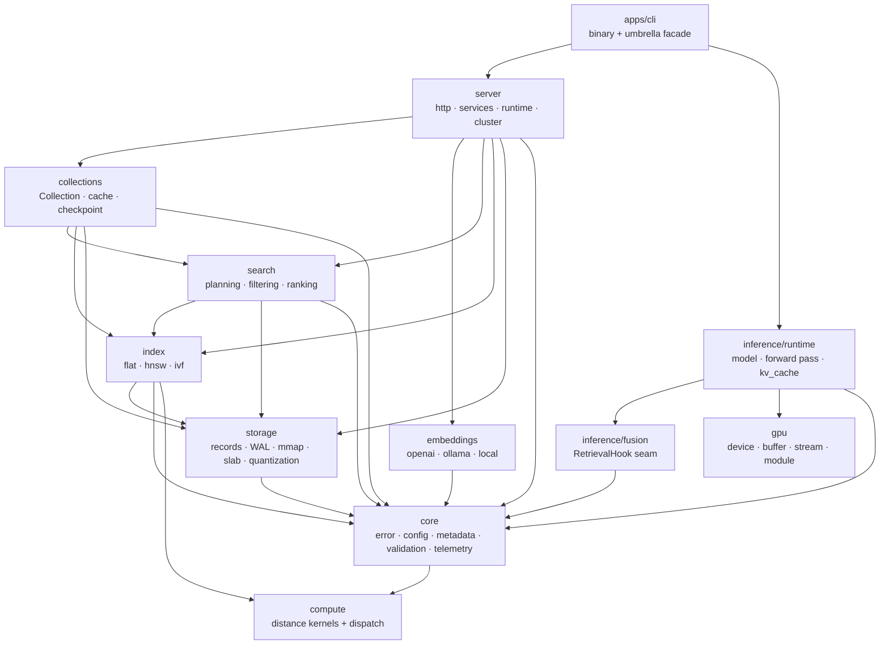
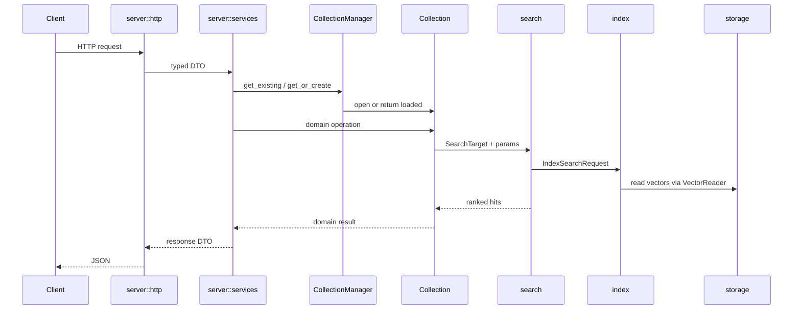
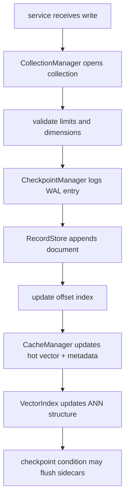

# Architecture

How the workspace is cut, why each boundary is where it is, and what must stay true.

## The shape of the problem

Piramid runs retrieval and (eventually) transformer inference in one process. That single-process
goal is exactly what makes internal boundaries matter: with no network between the layers, nothing
stops them growing into each other except discipline that something enforces.

So the layering is physical. Each layer is a crate, and `scripts/check-deps.sh` fails CI on an
edge that is not in the law below.

## The tree

```text
apps/                     everything first-party
  engine/                 the library crates — grouped by subsystem
    foundation/core       shared vocabulary
    hardware/             code that cares what machine it runs on
      compute  gpu
    retrieval/            everything that finds vectors
      storage  index  search  collections  embeddings
    inference/            everything that runs a model
      fusion   runtime
    service/              how the outside world reaches it
      server   observability
  cli/                    the piramid binary — fuses the engine into one artifact
  website/                piramiddb.com, with blog content and images inside it
  sdk/                    npm and python clients

deploy/  docs/  scripts/  .claude/  .github/     how it is built, shipped, and explained
```

Two things this naming is doing. `engine/` says what the thing *is* — "crates" describes Rust's
compilation model, not the product. And **one binary does not mean one folder**: the engine is
twelve crates across five subsystems, and `apps/cli` is the thing that fuses them into an
artifact.

`apps/` means "everything we author", not "everything separately deployable" — which is why the
engine and the SDKs sit beside the binary and the site. `deploy/` stays outside it because it
describes how those are packaged, not something we author.

The subsystem groups are for navigation. They are *not* the dependency order — that is the law
below, and it does not line up one-to-one with the folders (`foundation/core` depends on
`hardware/compute` for the `ExecutionMode` and `Metric` types configuration carries).

## Crates



| Crate | Owns | Must not |
|---|---|---|
| `core` | Errors, configuration, metadata + filters, validation, telemetry | Know about HTTP, or end the process |
| `compute` | Distance math, backend selection | Depend on anything in the workspace |
| `gpu` | Device runtime: contexts, buffers, streams, modules, kernels | Contain math semantics; leak vendor types |
| `storage` | Records, WAL, sidecars, mmap, vector layout, quantization | Decide API behavior or collection lifecycle |
| `index` | ANN traversal, index settings, sidecar format | Own collection storage or vectors |
| `search` | Overfetch planning, scoring, filtering, ranking | Know what a `Collection` is |
| `collections` | The `Collection` object, cache, checkpoint, compaction | Serve HTTP |
| `embeddings` | Provider adapters, caching, retries | Know about collections |
| `inference/fusion` | The `RetrievalHook` seam | Depend on the retrieval stack |
| `inference/runtime` | Model execution, KV cache, batching, sampling | Depend on the retrieval stack; be required for retrieval to work |
| `server` | Routes, handlers, services, `AppState`, routing | Touch file formats or index internals |
| `apps/cli` | Argument parsing, process lifecycle, terminal output | Contain domain logic |

## The dependency law

A crate may depend on one listed below it; the reverse is a violation.

```
compute ─┐                    gpu ─┐
         │                         ├─→ inference/runtime ─┐
core ────┼─→ storage ─→ index ─→ search ─→ collections ─→ server ─→ cli
         ├─→ embeddings ──────────────────────────────────┘
         └─→ fusion ─→ inference/runtime
```

`scripts/check-deps.sh` holds the allow-list. Adding an edge means editing that file and this
document in the same change.

### Why `compute` and `gpu` are leaves

Neither depends on anything in the workspace, `core` included.

`compute` is leaf because kernels should be liftable into a standalone benchmark with no drag, and
because a kernel layer that imports application configuration cannot be reasoned about
independently. `ExecutionMode` therefore lives in `compute` and is re-exported by `config`, not the
other way round — it names a backend, which is a compute concern, not a policy one.

`gpu` is leaf because **two** subsystems need a device: `compute` for distance kernels and
`inference` for model execution. If the device runtime lived inside `compute`, inference would have
to depend on retrieval math to allocate memory. Keeping `gpu` a peer means both share one `Device`,
which is the entire point — vectors and model weights must sit in the same address space for
retrieval and generation to meet without a host round-trip.

```
compute/backends/cuda.rs ──┐
                           ├──→ gpu  (Device, DeviceBuffer, Stream, KernelModule)
inference/backends/*.rs  ──┘
```

## The three seams

Everything else exists to make these cheap to implement and swap.

### `compute::DistanceKernels`

One backend per file in `compute/backends/`, one arm in the registry. Nothing else changes.

```rust
fn cosine_batch(&self, query: &[f32], candidates: &[f32], dim: usize, out: &mut [f32])
    -> ComputeResult<()>;
```

`candidates` is a **contiguous row-major slab**, not `&[Vec<f32>]`. A slab uploads to a device in
one `memcpy`; a slice of `Vec`s is a set of scattered heap allocations that a device backend would
have to gather on *every call*, and that gather costs more than the kernel saves. `out` is
caller-owned so the buffer can be reused across queries and later pinned for async transfer.

CPU backends get correct batch behavior free from default implementations that loop over the
pairwise methods; a device backend overrides them with a real launch.

Dispatch never panics. `backends::resolve_available` falls back to the best CPU backend with a
`warn` when the requested one is missing, so a config asking for `gpu` on a machine without one
degrades instead of crashing.

### `storage::vectors::VectorReader`

How an index reads vectors it does not own, so the backing store can change — cache-backed today,
slab-backed or mmap-backed later — without touching any index.

`as_slab() -> Option<(&[f32], usize)>` is the fast path; a reader over scattered allocations
returns `None` rather than silently copying, because hiding that cost would make the CPU/device
choice unmeasurable. `gather_into()` is the portable fallback. Both have defaults.

`VectorSlab` (contiguous `Vec<f32>` + stride + `Uuid → u32` ordinals) exists and is not yet the
default; migrating `CacheManager` onto it is tracked in the roadmap and can happen one call site at
a time because `as_slab` is optional.

### `piramid_fusion::RetrievalHook`

Where retrieval enters the forward pass.

```rust
fn wants(&self, point: FusionPoint) -> bool;
fn on_fusion_point(&self, ctx: &mut ForwardContext<'_>) -> Result<()>;
```

Deliberately mechanism-agnostic: it says *when* retrieval may occur and *what it may touch*, not
how retrieved data is combined. Chunked cross-attention, residual-stream gating, and learned index
routing are all implementations of this one trait.

It is defined before anything can call it because a forward-pass driver written without the seam is
very hard to retrofit with one, and a driver written with it costs nothing extra. `ForwardContext`
is a named struct rather than a parameter list so adding state later does not break every
implementation.

## Request flow



Conversion boundaries are explicit: HTTP shapes in `server::http`, operational decisions in
`server::services`, domain mutation in `collections`, bytes and files in `storage`.

Note `search` takes a `SearchTarget` — index, readers, and defaults — rather than a `Collection`.
That is what keeps `search` below `collections` instead of circular with it.

## Write path

The record store plus sidecars are the source of truth. Cache and index are acceleration
structures that must remain rebuildable from stored records.



## Durability

WAL plus checkpoints. `CheckpointManager` owns collection-level bookkeeping and WAL rotation;
byte-level serialization stays in `storage`. On open, the builder loads sidecars, opens the record
store, initializes the WAL, and replays if needed.

An index owns its own sidecar format, so save/load lives in `index::persistence`, not `storage`.

## Errors

`core` is transport-agnostic. `PiramidError::kind()` returns an `ErrorKind` — `NotFound`,
`Conflict`, `Upstream`, `Internal`, … — with no notion of a status code. `server::http::ApiError`
is a newtype in the transport layer that maps a kind onto an HTTP status and renders JSON.

Handlers keep `?` ergonomics because `ApiError` converts from anything that converts into
`PiramidError`, so a handler returns `ApiResult<T>` while everything below returns
`piramid_core::Result`.

This is also why the orphan rule is not a problem: the `IntoResponse` impl is on a local newtype.

## Invariants

1. `compute` and `gpu` depend on nothing in the workspace.
2. No library crate calls `std::process::exit`. Configuration loading returns `Result`.
3. `core` never names an HTTP type.
4. Vendor SDK types (`cudarc`, `candle`) never escape their backend module.
5. `unsafe` appears only in `apps/engine/hardware/gpu` and two audited sites, each with a `// SAFETY:` comment.
6. Cache and index are rebuildable from the record store.
7. Retrieval works with no model loaded, and `inference/runtime` depends on nothing in the
   retrieval stack. `fusion` is the seam between them and holds only the trait; a concrete
   strategy is a separate crate that depends on both it and `search`. Enforced by
   `scripts/check-deps.sh`.
8. Default builds are CPU-only and need no vendor toolchain.

## Adding code

1. HTTP-specific → `apps/engine/service/server/src/http`.
2. Coordinates a user-facing operation → `apps/engine/service/server/src/services`.
3. Changes one collection's state → `apps/engine/retrieval/collections`.
4. Reads or writes bytes, mmap, WAL, sidecars → `apps/engine/retrieval/storage`.
5. ANN implementation detail → `apps/engine/retrieval/index`.
6. Distance math or backend dispatch → `apps/engine/hardware/compute`.
7. Device memory, streams, kernels → `apps/engine/hardware/gpu`.
8. Model execution → `apps/engine/inference/runtime`.
9. Retrieval inside the forward pass → `apps/engine/inference/fusion`.
10. Shared vocabulary (error, config, metadata) → `apps/engine/foundation/core`.
11. A deployable, a site, or a client library → `apps/`.

If a change touches three or more crates, start at the service boundary and make the data flow
explicit before writing anything.
